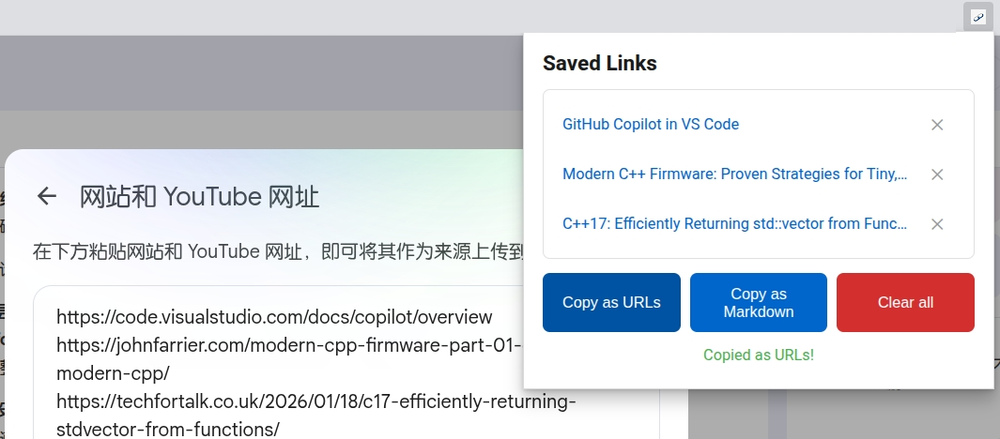

# Link Stash

A Chrome extension to collect and cache web links for easy batch copying to NotebookLM and other tools.

## Features

- **Stash links** - Right-click on any page to save the current URL with its title
- **Save link text** - Right-click on any link to save it with its actual text
- **Batch export** - Copy all saved links as plain URLs or markdown format
- **Markdown support** - Export as `[Page Title](url)` for better readability
- **Quick copy** - Context menu option to copy all links from anywhere

## Installation

### From Source (Development)

1. Clone this repository (or download ZIP and extract)
2. Open Chrome and go to `chrome://extensions/`
3. Enable "Developer mode" (toggle in top-right)
4. Click "Load unpacked"
5. Select the `link_stash` directory

### From Chrome Web Store

*(Coming soon)*

## Usage

### Saving Links

- **Save current page**: Right-click anywhere on a page → "Stash link"
- **Save specific link**: Right-click on any link → "Save Link"

### Managing Links

1. Click the extension icon to open the popup
2. View all saved links (showing page titles)
3. Hover over links to see full URLs
4. Delete individual links with the × button
5. Clear all links with "Clear All"

### Copying Links

- **Copy as URLs**: Plain text, one URL per line
- **Copy as Markdown**: `[Page Title](url)` format
- **Copy from context menu**: Right-click anywhere → "Copy all"

## Development

The extension consists of:

- `manifest.json` - Extension configuration
- `background.js` - Service worker for context menus and storage
- `content.js` - Content script to capture link text
- `popup.html/js/css` - Popup UI for managing links

## License

MIT

---

# Link Stash (链接收藏夹)

一个用于收集和缓存网页链接的 Chrome 扩展，方便批量复制到 NotebookLM 和其他工具。

## 功能特点

- **收藏链接** - 在任何页面右键保存当前网址及其标题
- **保存链接文本** - 右键点击任何链接保存其实际文本
- **批量导出** - 将所有保存的链接复制为纯文本网址或 Markdown 格式
- **Markdown 支持** - 导出为 `[页面标题](url)` 格式，可读性更强
- **快速管理** - 通过弹出窗口轻松管理所有链接

## 安装方法

### 从源码安装（开发模式）

1. 克隆此仓库（或下载 ZIP 压缩包并解压）
2. 打开 Chrome 浏览器，访问 `chrome://extensions/`
3. 启用右上角的"开发者模式"
4. 点击"加载已解压的扩展程序"
5. 选择 `link_stash` 目录

### 从 Chrome 网上应用店安装

*（即将推出）*

## 使用方法

### 保存链接

- **保存当前页面**：在页面任意位置右键 → "Stash link"
- **保存特定链接**：在任意链接上右键 → "Save Link"

### 管理链接

1. 点击扩展图标打开弹出窗口
2. 查看所有保存的链接（显示页面标题）
3. 鼠标悬停查看完整网址
4. 使用 × 按钮删除单个链接
5. 使用"Clear All"清除所有链接

### 复制链接

- **复制为网址**：纯文本格式，每行一个网址
- **复制为 Markdown**：`[页面标题](url)` 格式

## 开发说明

扩展包含以下文件：

- `manifest.json` - 扩展配置
- `background.js` - 后台服务，处理右键菜单和存储
- `content.js` - 内容脚本，捕获链接文本
- `popup.html/js/css` - 弹出窗口界面

## 许可证

MIT
